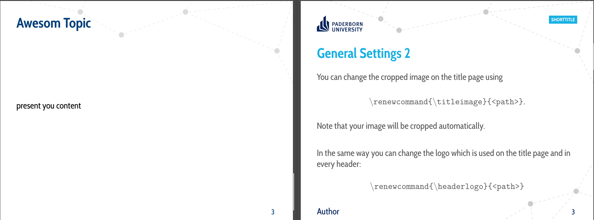

# About

This is a simplification of Max Hoffmann's original design, which tried to be as close to the corporate design (for Powerpoint) as possible.
I find the official version way to busy so I removed a lot of the elements but tried to keep in with the original design.
The old example can still be found as `upb2018-example.pdf`.
A basic example of the new style can be found in `main.pdf`.

## What I Changed

A side-by-side what I changed/added so you can decide for yourself which version you prefer.
You can always head back to <https://github.com/tux4ever42/latexBeamerTemplateUPB> if you don't agree with my changes or want/need to be as close to the official design as possible.

### Title Slide

Not much changed here.

- I changed the default color to the dark blue as it provides better contrast and is the same color as the logo (i.e. removing unnecessary many colors).
- The default picture is one I've taken from the stairwell in the F building, as I am a computer scientist and this is where we spend our time.
- Also minor changes to the network nodes design.


### Normal Slides

I removed large parts of what I perceive as “clutter“, i.e.:

- UPB logo
- short title
- author's name
- footer decoration

This allows more space on the slide for more content, as the title could be move up where the logo was previously.



### Section Slide

I added this slide-type, as I like to announce sections with their own “title”.
It is provided by a command that uses the current section title (set with `\section`), the example is produced with:

```tex
\section{Main Body of Content}\sectionframe%
```


### Preface Slide

To “get back“ the more crowded network design of the normal slides from the original design I added a `preface` environment.
Every slide in this environment will have a header **and footer** network.
The name stems from the fact that I intend to use it in the preface (motivation, table of contents, etc), but of course it can be used everywhere (in fact is it used for the `\sectionframe` command).

The example can be produced with:
```tex
\begin{preface}
\begin{frame}{Overview}
    \tableofcontents
\end{frame}
\end{preface}
```


# CHANGELOG

version 17/06/2022
	Add the changes explained above.

version 31/01/2019
	Change of the implementation of the slide-footline. In the new
	version the footline-network-nodes are drawn on the background layer
	of the slides. (Many thanks to Alexander Klump for the initial idea.)

version 19/12/2018:
	Implementation of the handout-mode with the option to choose, how many
	slides are printed on one page.
