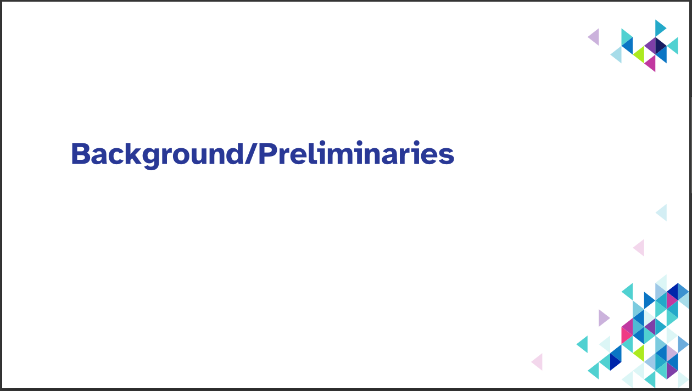

# About

This is an adaption of the official PowerPoint slide theme by the university of Paderborn for LaTeX Beamer.
I find the official version way to busy so I removed a lot of the elements but tried to keep in with the original design.
Also I've added macros/styles I personally use for presentations.
Thus, this implementation is quite opinionated towards a specific style and workflow.

This repo used to host the same project, but for the old corporate design (hence, why it is a fork of another project).

## What I Changed

A side-by-side what I changed/added.
If you don't agree with my adaptions you are free to add the missing styles in a forked project ;)

### Font

I use [Atkinson Hyperlegible](https://en.wikipedia.org/wiki/Atkinson_Hyperlegible) as a font for the presentation.
Not only is this typeface optimized for distinguishability between characters, but also I set the font size slightly bigger than the university's template.
I think that everyone can get use out of a font that is easily legible in non-perfect condition, even someone with perfect sight.
I am still disappointed that the university chose a typeface that is so inaccessible.

The Corporate Design Font of the UPB (Karla):


Atkinson Hyperlegible:


### Title Slide

Not much changed here, changes mainly go back to the font decision.


You can remove the title page with the `skiptitlepage` class option.

### Normal Slides

I removed what I perceive as “clutter“, i.e.:

- UPB logo
- author's name

This allows more space on the slide for more content, as the title could be move up where the logo was previously.


Optionally, there is a variant with the logo (`uselogo` class option):


### Section Slide

I added this slide-type, as I like to announce sections with their own “title”.
Create a section slide with `\Section` (notice the capital S).

Internally `\sectionframe` creates the slide using the current section title (set with `\section`).

```tex
\Section{Background/Preliminaries}

% this would produce the same slide, but would not add the heading to the ToC
\Section*{Background/Preliminaries}

% the old way still works:
\section{Background/Preliminaries}\sectionframe%
```

I avoid the official design for this as it is way to full IMHO.



### Preface Slide

The `preface` option to the frame environment produces a slide without a number in the default settings and a more filled graphic when using the `busypreface` class option.
The name stems from the intended use in the preface (motivation, table of contents, etc), but of course it can be used everywhere (in fact the busy version is used for the `\sectionframe` command).

The example can be produced with:
```tex
\begin{frame}[preface]{Question to Answer}
    what questions do you want to answer with this presentation?
\end{frame}

% the olf version still works as well and might be useful for multiple slides back-to-back
\begin{preface}
\begin{frame}{Question to Answer}
    what questions do you want to answer with this presentation?
\end{frame}
\end{preface}
```


## Additional Code/Options

- `\textfit` make the contained text as large as possible while being in a single line.
  This can be used for statement slides.
- The `empty` frame option completely removes the design elements. `plain` only removes the page number.

## slide types I removed because I find them to be too cluttered/unnecessary


# CHANGELOG

version 28/08/2023
	Rewrite completely for new corporate design (I don't think this uses any of the original code).
	This stays compatible to my old version (I think).

version 17/06/2022
	Add the changes explained above.

version 31/01/2019
	Change of the implementation of the slide-footline. In the new
	version the footline-network-nodes are drawn on the background layer
	of the slides. (Many thanks to Alexander Klump for the initial idea.)

version 19/12/2018:
	Implementation of the handout-mode with the option to choose, how many
	slides are printed on one page.
